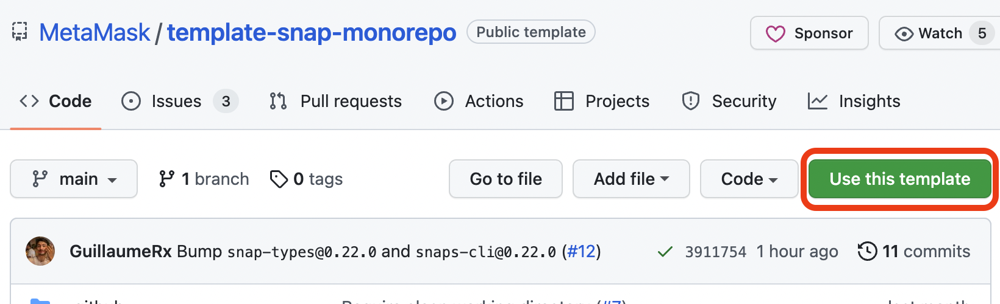
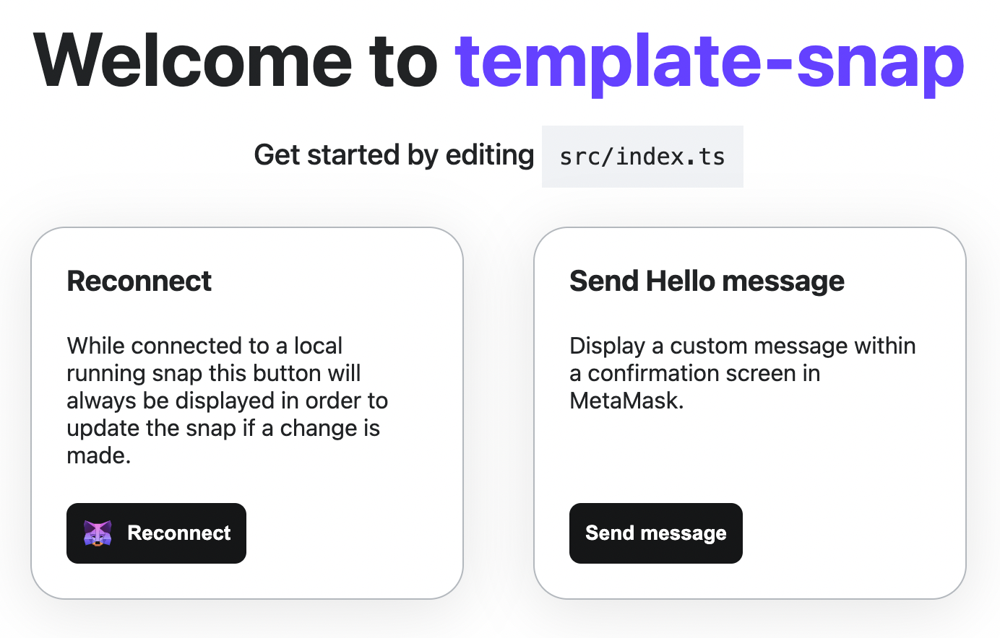
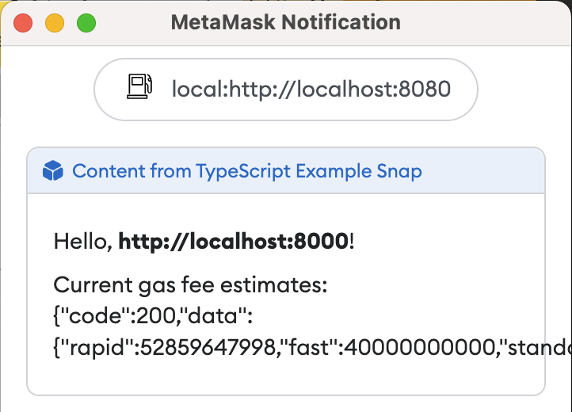

# @Montoya/gas-fee-snap

A simple Snap example based on [@MetaMask/template-snap-monorepo](https://github.com/MetaMask/template-snap-monorepo). Read below for a tutorial!

## Prerequisites

Before you begin, make sure you have the following installed: 

* Latest Google Chrome or Firefox 
* [MetaMask Flask](https://metamask.io/flask/)
* [Node.js](https://nodejs.org/) version 16 (I recommend using [nvm](https://github.com/nvm-sh/nvm))
* [Yarn](https://yarnpkg.com/) version 3
* A text editor or IDE like [Visual Studio Code](https://code.visualstudio.com/)
* Optionally, a [GitHub account](https://github.com/) and a git client like [GitHub Desktop](https://desktop.github.com/)

*Please note: MetaMask Flask is experimental preview software. Please do not use your existing secret recovery phrase or keys with Flask. It is recommended that you create a new SRP for testing with Flask. Also, you cannot run it alongside stable MetaMask, so either disable that or set up a new browser profile to run Flask.*

## The 5-Minute Snap Tutorial

In this tutorial, you will learn how to use the snap template and CLI tools, how to add permissions to be requested at runtime, how to use the `fetch` API to request information from the Internet, and how to display custom information in a snap confirmation. The snap you will build is not meant to be a perfect way to show gas fee estimates but rather to demonstrate some features to get you started building with Snaps.

First, navigate to the [@MetaMask/template-snap-monorepo](https://github.com/MetaMask/template-snap-monorepo) repository and click "Use this template."

<a href="https://github.com/MetaMask/template-snap-monorepo"></a>

Give your new snap a name, like `gas-fee-snap`. Clone the respository to your local machine. Now you are ready to start modifying the files in your snap.

### Initialize your development environment with the required dependencies

Open the main folder of your repository with a command line tool like `cmd` or `terminal`. Make sure you are using Node.js version 16 (if you installed nvm, type `nvm use` and hit enter to set the local version in this folder to 16) and yarn version 3. Then, type `yarn` and hit enter. 

Now you are ready to start modifying your snap!

### Setting a custom icon for your snap

Since this is a gas fee snap, why not use a gas pump as the icon? Open the `snap.manifest.json` file in `/packages/snap`. This file has the main configuration details for your snap. Edit the section under `npm` to change the `iconPath` to your new icon: 

```json
"location": {
   "npm": {
      "filePath": "dist/bundle.js",
      "iconPath": "images/gas.svg",
      "packageName": "snap",
      "registry": "https://registry.npmjs.org/"
   }
```

Then, place [this file](https://raw.githubusercontent.com/Montoya/gas-fee-snap/main/packages/snap/images/gas.svg) into the `images` folder. This is a free icon, "Gas" by Mello from [Noun Project](https://thenounproject.com/browse/icons/term/gas/). 

### Adding the Network Access Permission to your Snap

Open `snap.manifest.json` again. To enable your Snap to use the `fetch` API, you need to request the "network access" permission. You can do this by modifying `initialPermissions` to include this permission, like so: 

```JSON
"initialPermissions": {
  "snap_dialog": {},
  "endowment:rpc": {
    "dapps": true,
    "snaps": false
  }, 
  "endowment:network-access": {}
},
```

*Don't forget to add the comma `,` after the permission before it!*

### Fetching Gas Fee Estimates 

Now that you have the network access permission, you can use the `fetch` API in your snap! Open `/packages/snap/src/index.ts`. This is the main code file for your Snap. To get a gas fee estimate, you will use the public API endpoint provided by etherchain.org. Add the following async function to the top of the file:  

```TypeScript
import { OnRpcRequestHandler } from '@metamask/snaps-types';
import { panel, text } from '@metamask/snaps-ui';

async function getFees() {
  const response = await fetch('https://beaconcha.in/api/v1/execution/gasnow'); 
  return response.text();
}

/**
```

Then, modify the Snap RPC Message Handler that dislays the confirmation window. This handler uses a `switch` statement to handle various request methods, but in this case there is only one method: "hello." For this method, it returns a wallet request (a call to MetaMask) with the parameters to display a confirmation window and passes some static strings. 

Since the `getFees()` function returns a promise, you will need to use `then()` to resolve it in your hello method. Rewrite the `hello` method with the following code: 

```TypeScript
export const onRpcRequest: OnRpcRequestHandler = ({ origin, request }) => {
  switch (request.method) {
    case 'hello':
      return getFees().then(fees => { 
        return snap.request({
          method: 'snap_dialog', 
          params: { 
            type: 'Alert', 
            content: panel([
              text(`Hello, **${origin}**!`), 
              text(`Current gas fee estimates: ${fees}`), 
            ]), 
          }
        }); 
      });  
```

*Note the use of backticks \`, this is a template string that allows variables to be embedded with \${...}.*

### Building and testing your Snap

Open `package.json` in the main directory of the repository and bump the version (if `0.1.0`, bump it to `0.2.0`). 

From the command line, run the following command to build and test your Snap: `yarn start`. 

After the last command, you should get a message that includes: 

```Shell
You can now view site in the browser.

  http://localhost:8000/
```

Your default browser should open and navigate to this address, but if not, open Google Chrome or Firefox (with MetaMask Flask installed) and navigate to [localhost:8000](http://localhost:8000). You will see a page like the following: 



This is a boilerplate test Dapp for installing and testing your Snap. Click "Connect" to connect Flask to the Dapp. After connecting, you will be prompted to install the Snap with these permissions: "Display dialog windows in MetaMask," "Allow websites to communicate directly with this snap," and "Access the internet." Click "Approve &amp; install", then click the "Send Hello" button. You should see a dialog prompt with the response from the gas fee API: 



Congratulations! You just integrated a public API into MetaMask and displayed real-time gas fee estimates. 

## Next Steps

Next, you can try parsing the JSON response from the remote API and displaying the fees in a nicely formatted way. 

You can also update the fields in `snap.manifest.json` to match your custom Snap: 

* proposedName: I used Gas Fee Snap but you can use whatever you prefer
* description: up to you
* repository: the `url` should match your GitHub repo where you cloned the template
* source: the `shasum` is set automatically when you build from the command line. The location should be based on where it is published on NPM if you decide to publish. 

Likewise, you should update the name, version, description, and repository sections of `package.json` even if you do not plan to publish your Snap to NPM. _Note: the `version` field in `snap.manifest.json` inherits the `version` field from `package.json`._

Lastly, you can update the content of `/packages/site/src/pages/index.tsx`, such as changing the name of the method for showing gas fee estimates, but make sure to change the method name in `/packages/snap/src/index.ts` as well to match. In this repository, the method name has been changed to `fees` and the content of `index.tsx` has been changed so that the button to invoke it is appropriately labeled "Show Gas Fees." 

Once you have made all these changes you can publish your snap to NPM and make the Dapp public so that others can install and try your custom snap in MetaMask Flask!

## Helpful Resources 

[MetaMask Snaps Getting Started Guide](https://github.com/MetaMask/snaps-skunkworks/discussions/675)

Building a Snap? Want to learn more? Join the [discussion board](https://github.com/MetaMask/snaps-skunkworks/discussions) and let us know!
