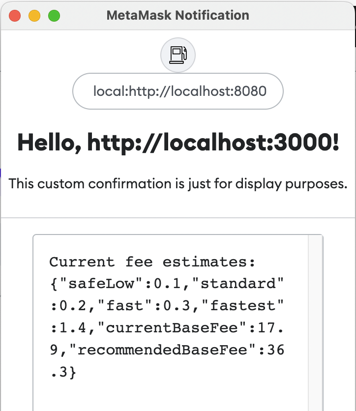

# @Montoya/gas-fee-snap

A simple Snap example based on [@MetaMask/template-snap](https://github.com/MetaMask/template-snap). Read below for a tutorial!

## Prerequisites

Before you begin, make sure you have the following installed: 

* [Google Chrome](https://www.google.com/chrome/) 
* [MetaMask Flask](https://metamask.io/flask/)\* 
* [Node.js](https://nodejs.org/) 
* [Yarn](https://yarnpkg.com/)
* A text editor or IDE like [Visual Studio Code](https://code.visualstudio.com/)
* Optionally, a [GitHub account](https://github.com/) and a git client like [GitHub Desktop](https://desktop.github.com/)

\* *Please note: MetaMask Flask is experimental preview software. Please do not use your existing secret recovery phrase or keys with Flask. It is recommended that you create a new SRP for testing with Flask.*

## The 5-Minute Snap Tutorial

In this tutorial, you will learn how to use the Snap template and CLI tools, how to add permissions to be requested at runtime, how to use the `fetch` API to request information from the Internet, and how to display custom information in a Snap Confirmation. The Snap you will implement is not meant to be an ideal way to show gas fee estimates but rather to demonstrate some features to get you started building with Snaps.

First, navigate to the [@MetaMask/template-snap](https://github.com/MetaMask/template-snap) repository and click "Use this template."


Give your new Snap a name, like `gas-fee-snap`. Clone the respository to your local machine. Open a command line tool and run `./scripts/cleanup.sh` to remove some MetaMask-specific files that will not work outside of the MetaMask GitHub organization. Now you are ready to start modifying the files in your Snap.

### Adding the Network Access Permission to your Snap

Open `snap.manifest.json`. This file has the main configuration details for your Snap. To enable your Snap to use the `fetch` API, you need to request the "network access" permission. You can do this by modifying `initialPermissions` to include this permission, like so: 

```JSON
"initialPermissions": {
  "snap_confirm": {}, 
  "endowment:network-access": {}
},
```

### Fetching Gas Fee Estimates 

Open `src/index.js`. This is the main code file for your Snap. To get a gas fee estimate, you will use the public API endpoint provided by etherchain.org. Add the following async function:  

```JavaScript
async function getFees() {
  let response = await fetch('https://www.etherchain.org/api/gasPriceOracle');
  return response.text();
} 
```

Then, modify the Snap RPC Message Handler that dislays the confirmation window. This handler uses a `switch` statement to handle various request methods, but in this case there is only one method: "hello." For this method, it returns a wallet request (a call to MetaMask) with the parameters to display a confirmation window and passes some static strings. 

Before the return statement, add a constant to receive the result from the `fetch` request: 

```JavaScript
case 'hello':
   const fees = await getFees(); 
   return wallet.request({
```

Then modify the `textAreaContent` parameter to display this result: 

```JavaScript
description:
   'This custom confirmation is just for display purposes.',
textAreaContent:
   'Current fee estimates: '+fees
```

### Building and testing your Snap

From the command line, run the following commands to build and test your Snap: 

```Shell
yarn install

yarn build:clean

yarn run serve
```

After the last command, you should get a message like the following: 

```Shell
yarn run v1.22.15
$ mm-snap serve

Starting server...
Server listening on: http://localhost:8081
```

Now, open Google Chrome and navigate to localhost:8080. You will see a page like the following: 


This is a boilerplate test Dapp for installing and testing your Snap. Click "Connect" to connect Flask to the Dapp. After connecting, you will be prompted to install the Snap with two permissions, "Display a confirmation" and "Access the Internet." Click "Approve &amp; Install", then click the "Send Hello" button. You should see a confirmation window like the following: 



Congratulations! You just integrated a public API into MetaMask and displayed real-time gas fee estimates. 

## Helpful Resources 

* [MetaMask Snaps Documentation](https://docs.metamask.io/guide/snaps.html)
* [Filecoin FilSnap by Chainsafe](https://github.com/ChainSafe/filsnap)
* [A curated list of awesome MetaMask Snaps related resources](https://github.com/piotr-roslaniec/awesome-metamask-snaps)